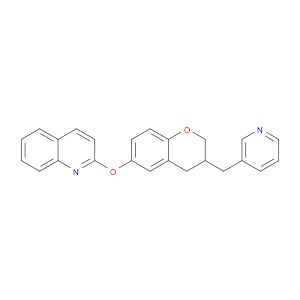
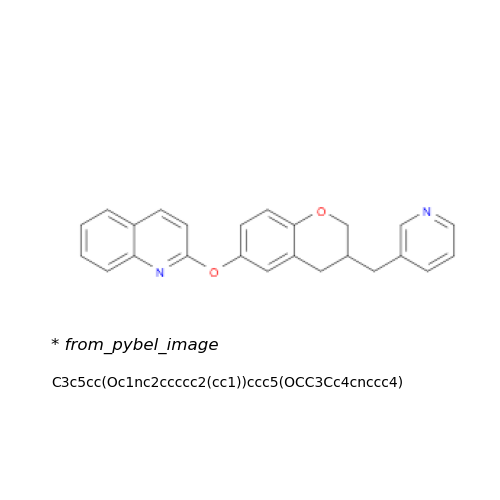
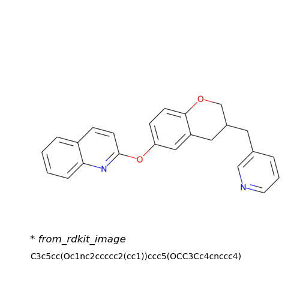
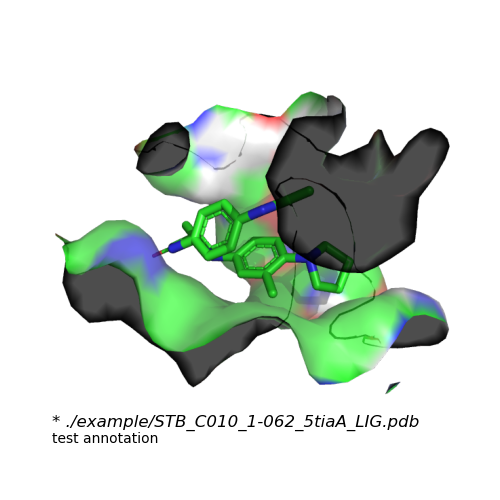
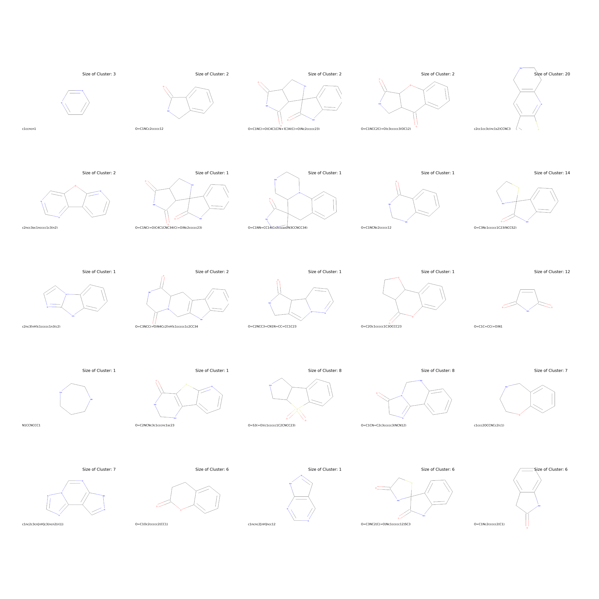

# Chemical Image
Chemical의 이미지를 그리는 방법

## 프로젝트 주제
Chemical의 "다양한 포맷"에 대해서 시각화 해보자

## 프로젝트 이유
Chemical의 "다양한 포맷"에 대해서 시각화를 하는 방법이 다양하기 때문에 각 포맷별 시각화 방법을 알아봐야 한다.

## 개발환경
* chemical processing
    * RD-kit
    * Babel
    * pymol
    * plip
* image processing    
    * matplotlib
* linux
    * python : 3.xx version
    * pymol : open-source version
    * plip : 2.2.2 version
    * openbabel : 3.1.1 version
    
## How to Install That Tools & Packages
* plip
  
  ```linux
  conda install -c conda-forge plip
  ```
* pymol
    ```linux
  conda install -c shrodinger pymol
  conda install -c conda-forge pymol-open-source
    ```
* openbabel
    ```linux
  conda install -c conda-forge openbabel
  ```
 * rdkit
   ```linux
   conda install -c rdkit rdkit
   ```

## 결과물
   
*pybel을 사용한 결과물들 중 첫번째*   
   
*pybel을 사용한 최종 결과물*   
   
*rdkit을 사용한 최종 결과물*    
   
*pymol을 사용한 surface 이미지*   
   
*결과물 들을 tiling한 이미지*   

